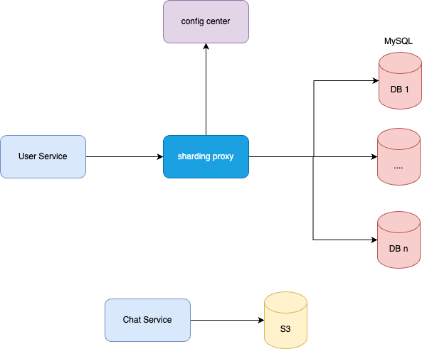

# 实现原理
面对海量的用户，如何为其快速找到邻近的人？
1. 首先将每个用户上次登录IP的地理位置采用GeoHash编码技术，将用户地理位置分别用数位（eg：8位）bit表示。
2. 然后将GeoHash值与用户ID列表的映射关系保存起来，比如key=prefix_101010101010101010， value= {userID1,userID2,xxx,userIDN}
3. 当用户访问其附近的人时，根据当前用户地理位置的GeoHash值，计算出附近人对应的GeoHash列表，这些GeoHash列表对应的用户就是与当前用户邻近的人。

# 概要设计

# 详细设计
## 存储设计
数据模型：

用户规模在10亿级别，因此用户信息表和用户关系表采用MySQL分库分表存储（eg:10个库，每个库100个表），而聊天记录表采用s3对象存储。设计图如下

## User Service
职责：管理用户信息。

日活跃用户量按总用户量的1/10来算，对于个人信息，client端只需要在刚开始打开app的时候获取一次用户信息，然后缓存在本地app就行，这样的话QPS=1157， 高峰预计为平均的两倍，即高峰期QPS=2300，并发量并不高，在做好限流的情况下，User Service可以直接操作DB，设计图如下所示：

## Chat Service 
职责：支持用户的聊天功能，以及管理用户聊天信息

假设平均每个活跃用户每天和10个好友聊天，给每个好友发100条消息，则TPS= 115w/s，高峰TPS = 230w/s，我们在设计了如下架构：

为了支持这么高的并发读写，我们引入了MQ来削流量高峰，异步处理用户消息，同时，DB Writer采用了聚合、批量、WAL等技术将用户消息写入S3的方式来提高吞吐。

API Gateway负责路由、限流、安全、权限检查等；

Chat Service负责接收用户发信过来，然后将其打包成消息发送给MQ，发送成功后，则返回给用户发送成功。

MQ： 采用kafka，100个partition，为了使相同用户聊天频道的信息能被同一台服务器处理，会将消息的key设置为chat_id。

Aggregator: 监听MQ中的消息，将最近10min内的消息暂存内存中，同时为了提高消息的高可用，可以采用WAL方式先将消息以顺序的方式写入本地文件中。同时有线程定期将最近10min的消息聚合，再将聚合后的消息写入MQ中。

DB Writer：负责将聚合后的消息批量写入S3中。

Chat Pusher：监听MQ中的消息，如果消息的接收方在线，则将该消息推送给接收方。
## Friend Service

redis中存储的是每个GeoHash编码值对应的userID列表, 比如key=location_10101010， value= {userID1,userID2,xxx,userIDN}

对于提供附近可能的好友的功能，一般一天只需要提供一次，所以这个筛选好友的QPS为2300，可以不用考虑并发量对服务的影响。流程如下所示：
1. client的附近好友请求通过API Gateway路由到某一台Friend service服务器上。
2. Friend service调用Location Service获取当前用户附近的userID列表。而用户的位置信息是在通过用户位置信息更新到DB中时，Location updater通过CDC技术捕捉到变更信息，从而更新到Redis中。
3. Friend service通过查询DB中当前用户的like，dislike列表，过滤这些重复的userID列表。
4. Friend service将过滤后的userID列表请求Rank Service，让其对其进行推荐排序（根据兴趣之类的tag）。
5. Friend service将排好序的用户返回给client

对于用户筛选功能，因为需要为每个可能的好友都需要调用一次，所以假设每天给用户提供的附近可能的好友数量为100，则TPS为=23w，需要考虑高并发的影响。流程如下：
1. client将like或者dislike某个用户的请求经过API Gateway路由，发送到Friend Service服务器。
2. Friend Service将该请求打包成消息发送给MQ，成功则可以告诉client处理成功。
3. DB writer会根据like/dislike消息，按一定的并发量更新到user_relation_tab中。（当然如果并发量更高，可以选择聚合后再写入）

## 总体架构

# 设计小结
不足之处：
1. **未考虑图片功能**。对于现在的互联网应用来说，只要是涉及到需要吸引注意的部分，都是需要图片甚至是视频的，所以应该加图片功能加上。**有图片这等数据量不小的静态资源，也就意味着需要CDN**。
2. IM通讯协议不太清楚

其实Redis中提供GeoHash编码，以及附近人查找的功能。

# Q&A
Q1. 如何实现将消息推送到客户端？
1. IM服务端跟所有登录的IM客户端保持长连接（一条一直活跃的网络链路，每个客户端一条），长连接上定时会有心跳消息来监测客户端的在线离线状态，心跳消息就像邮递员每天都会在邮政局和邮箱之间巡回一样；
2. 在长连接服务中找到跟目标手机上IM客户端保持的长连接，并将消息发送给它。 这里面还有发件箱，收件箱的概念

Q2. IM协议都有哪些？
1. **http**短轮询/长轮询，实现简单; 开销大，轮询方式耗费服务器性能与带宽。 模式：请求-响应。 由于http连接必须由客户端发起的通讯特点，服务器要往客户推送消息，必须依赖由客户端发起的这条连接。因此在http的协议上做服务端的消息推送，需要客户端不断轮询，服务器有需要发送的消息时，就在轮询结果中返回给客户端。根据轮询类型的不同，又分为短轮询和长轮询。
2. **Websocket**。连接快，开销小， 模式：双向通讯。WebSocket的出现正是为解决服务器向客户端推送消息这个问题，在WebSocket出现之前，服务器向客户端推送消息，只能依赖客户端轮询，这会导致巨大的资源浪费。
