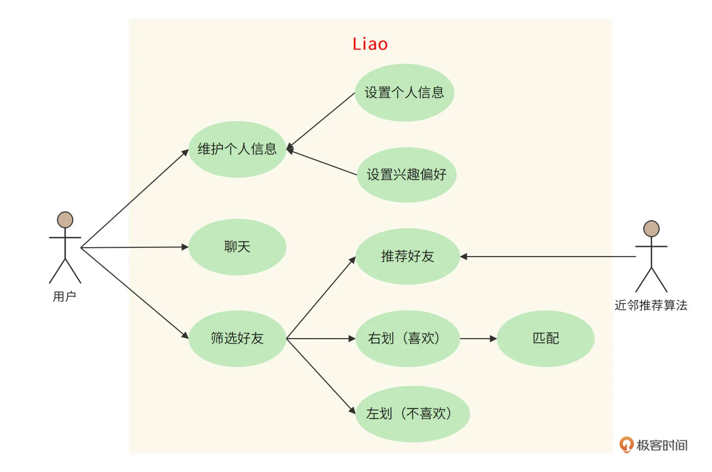

# 背景
交友与婚恋是人们最基本的需求之一。随着互联网时代的不断发展，移动社交软件已经成为了人们生活中必不可少的一部分。然而，熟人社交并不能完全满足年轻人的社交与情感需求，于是陌生人交友平台悄然兴起。

我们决定开发一款基于地理位置服务（LBS）的应用，为用户匹配邻近的、互相感兴趣的好友，应用名称为“Liao”。
# 功能需求
Liao 的客户端是一个移动 App，用户打开 App 后，上传、编辑自己的基本信息，然后系统（推荐算法）根据其地理位置和个人信息，为其推荐位置邻近的用户。用户在手机上查看对方的照片和资料，如果感兴趣，希望进一步联系，就向右滑动照片；如果不感兴趣，就向左滑动照片。

如果两个人都向右滑动了对方，就表示他们互相感兴趣。系统就通知他们配对成功，并为他们开启聊天功能，可以更进一步了解对方，决定是否建立更深入的关系。

Liao 的功能用例图如下：

# 非功能需求
规模大小：Liao 的目标用户是全球范围内的中青年单身男女，预估目标用户超过 10 亿
