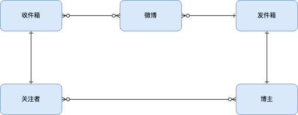
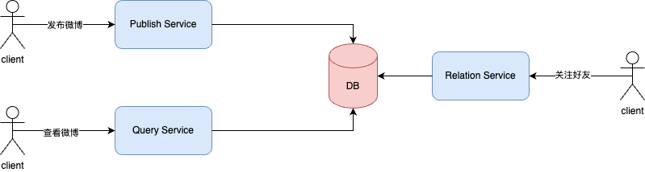
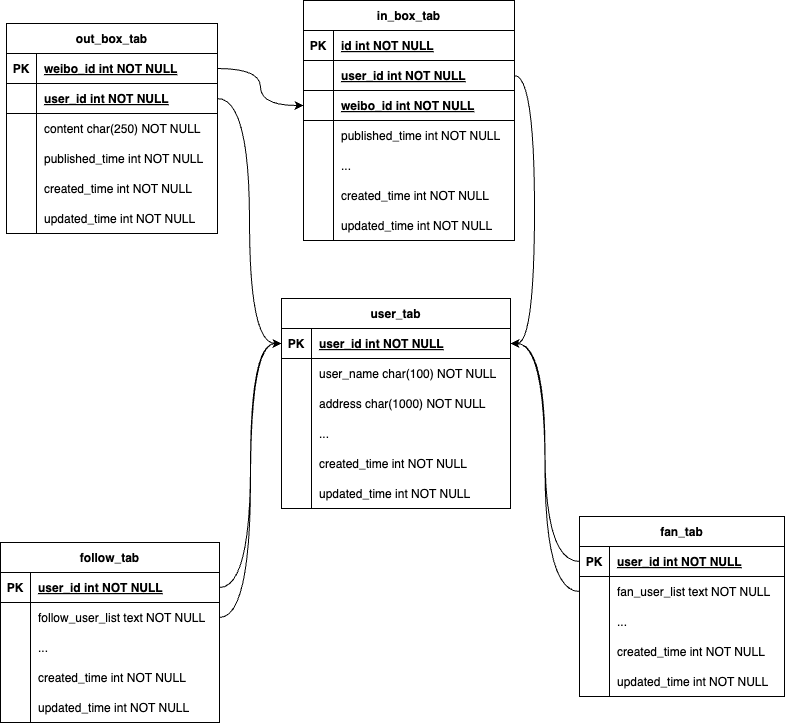
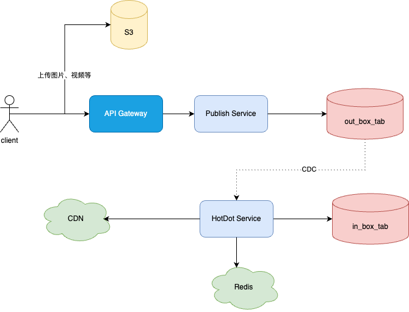
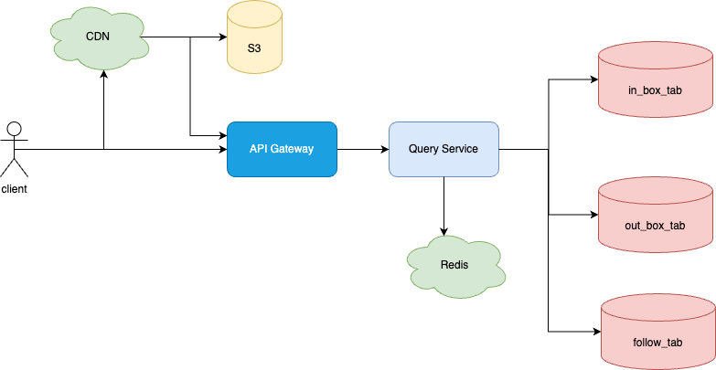
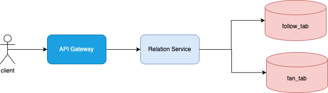
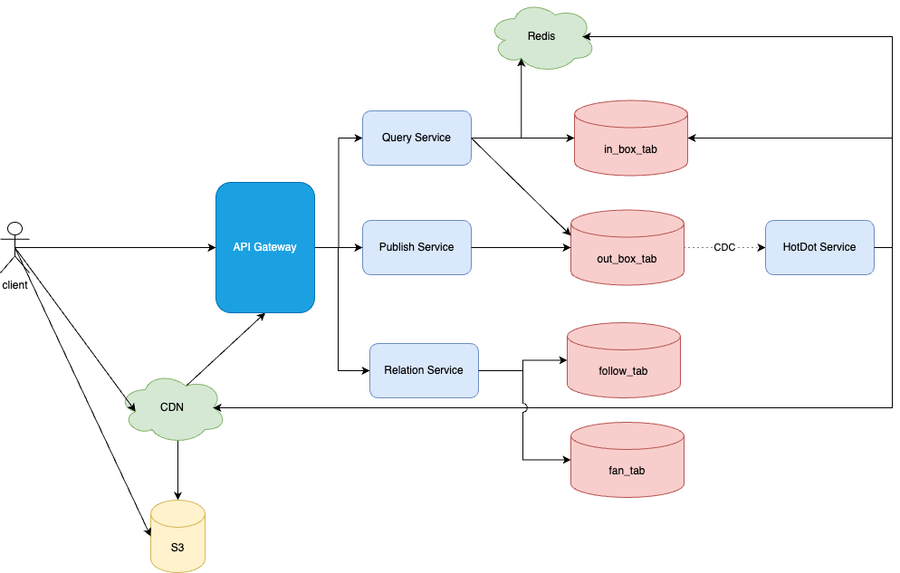

# 实现原理
微博这样类似的信息流系统架构是如何设计的？
1. 利用收件箱和发件箱机制
2. 每个用户都可以是关注者和博主，分别有收件箱和发件箱。收件箱中收录着该用户所有关注的人发布的部分或所有微博，发件箱中收录该博主发布的所有微博。

如何解决大 V 们的热点消息产生的突发高并发访问压力，保障系统的可用性？
1. 大V们发布的微博，主动推送CDN和Redis缓存。
2. 主动将微博元信息（微博ID，发布时间，博主等）发送到在线的关注者的收件箱中。
3. 数据库分库分表，一主二从，降低单机压力。
4. 请求合并
5. DB限流

# 概要设计



# 详细设计
## 存储设计
//假设两亿日活用户每天浏览两次微博，每次向上滑动或者进入某个人的主页 10 次，每次显示 20 条微博，每天刷新微博次数 40 亿次，即 40 亿次微博查询接口调用，平均 QPS 大约 5 万，访问高峰期 QPS 按平均值 2 倍计算，所以系统需要满足 10 万 QPS。


发件箱out_box_tab采用分库分表的方式：100个库，每个库1000个表。每天的微博数为2亿, 三年的微博数为2190亿。
```shell
2亿 * 365 * 3 = 2190亿
```

收件箱in_box_tab采用分库分表的方式：100个库，每个库1000个表。同时会通过定期归档的方式，将发布时限超过10天的记录硬删除。

用户信息表user_tab采用分库分表：10个库，每个库10个表。

好友关注表follow_tab采用分库分表：10个库，每个库10个表。
被关注表fan_tab同样采用分库分表：10个库，每个库10个表。


上述表均采用MySQL存储。

## Publish Service


发布微博流程：
1. client将用户发布的微博中的图片、视频等上传到S3，然后用S3返回的图片/视频id替换微博中对应的图片、视频。
2. client通过API Gateway检查后，路由到Publish Service的某一台服务器上，Publish Service将该微博信息写入收件箱out_box_tab中，然后返回client发布成功。
3. HotDot Service 通过CDC技术监听out_box_tab知道有微博更新，并将该微博发送给关注它的在线用户的收件箱in_box_tab中。
4. 如果发布微博的不是大V，则发布流程到此为止，否则HotDot Service还会将该微博推送到CDN和Redis中。

写TPS = 2314， 对于100个库的out_bo_tab来说，完全不是问题。
## Query Service


对于刚上线的用户刷微博的流程：
1. client通过API Gateway检查后，路由到Query Service的某一台服务器上，Query Service请求follow_tab, 获取其关注的用户列表
2. Query Service根据关注的用户列表，以及收件箱in_box_tab中的微博状态，拉取最新的，收件箱中还没有的微博信息，并写入收件箱中。
3. 将最新的20条微博id通过排序挑选出来，然后返回给client。
4. client调用CDN获取对应的微博信息，若CDN中有，则直接返回，否则继续下一步。
5. CDN回源后台服务器集群和S3，获取对应的微博，返回给client，并缓存。

对于在线的用户刷微博的流程：
1. client通过API Gateway检查后，路由到Query Service的某一台服务器上，Query Service请求收件箱in_box_tab中微博，获取最新的微博id。
2. client调用CDN获取对应的微博信息，若CDN中有，则直接返回，否则继续下一步。 
3. CDN回源后台服务器集群和S3，获取对应的微博，返回给client，并缓存。

## Relation Service


通过发件箱模式保障事务一致性。

## 总体架构


# 小结


# Q&A