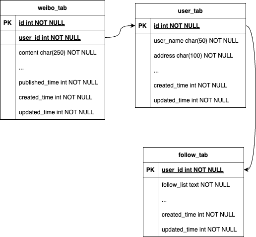
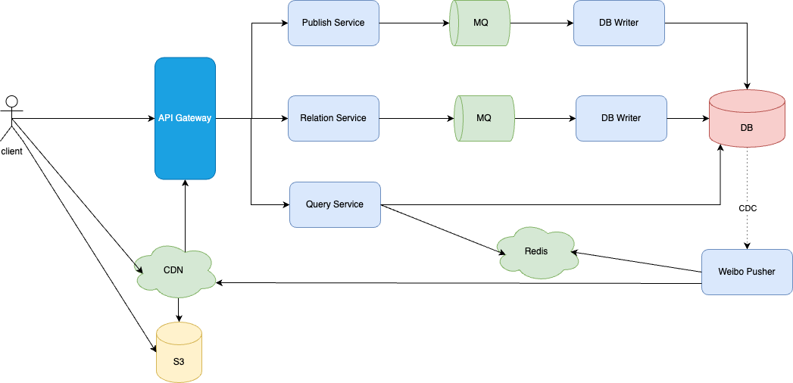

# 不足之处
1. 虽然平均TPS只有2000/s，但也不能直接写DB，因为还有很高的QPS，会造成DB压力很大。而且MQ能应对虽然最佳实践是通过MQ写。
2. 收件箱其实在这里只是相当个缓存，就没必要用DB来存储了，直接用redis缓存会更好。缓存时间：最近7天发布的微博。缓存容量：7天发布的微博量。
3. 收件箱-发件箱机制不是很符合微博场景，属于过度设计：1. 收发件箱模式适用于邮箱、IM等场景，而微博是典型的发布-订阅场景，只需要维护用户订阅关系和用户发布的内容即可； 2. 收件箱里的都是冗余数据，冗余数据的目的一般都是为了加速查询，这个时候使用缓存反而更合适。

# 数据模型

# system redesign

推拉结合。
推模式: 将微博id主动推到好友最新发表微博列表。系统会在缓存中为其创建一个好友最新发表微博列表，关注的好友如果有新发表微博，就立即将该微博插入列表的头部，当该用户刷新微博的时候，只需要将这个列表返回即可。
拉模式：在用户刷微博的时候拉取他关注的所有好友的最新微博，并加载到好友最新发表微博列表中。

cache中存储：
1. 好友最新发表微博列表：用户关注的人发布的微博id列表
2. 用户最近7天发布的微博。key = weibo_user_id, value = {weibo1, weibo2, ..., weiboN} 
3. 用户follow关系。key = follow_user_id, value = {userID1, userID2,...,userIDN}

