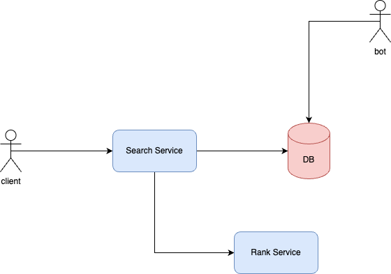
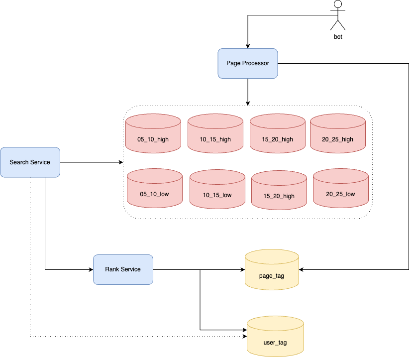
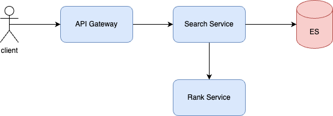
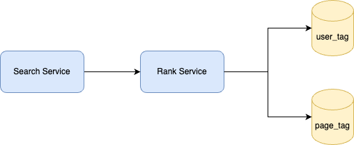
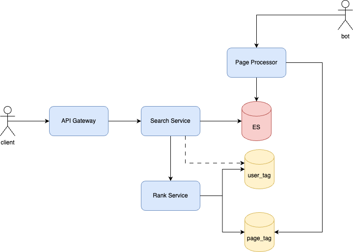

# 实现原理
针对爬虫获取的海量数据，如何高效地进行数据管理？
1. 使用ES进行海量数据存储。
2. 高质量和低质量网页使用不同的索引存储。
3. 每5年的网页用同一个索引存储。

当用户输入搜索词的时候，如何快速查找包含搜索词的网页内容？
1. 利助ES的倒排索引，从最近5年的高质量索引中快速搜索出相关的网页。

如何对搜索结果的网页内容进行排序，使排在搜索结果列表前面的网页，正好是用户期望看到的内容？
1. 粗排：从ES中获取出来的相关网页列表。
2. 精排：根据用户的标签，和网页的标签，进行匹配排序。

# 概要设计

# 详细设计
## 存储设计
规模大小：海量数据，1000亿网页，100PB存储量， 采用ES来存储。
对于高质量，低质量网页，已经不同时间段的网页分别采用不同的索引。

使用Redis cluster来存储网页tag， 假设每一个网页占用100B，则总的大小为10TB。用户tag也使用Redis cluster来存储。
设计图如下：

## Search Service

## Rank Service

## 总体架构

# 系统小结

# Q&A
为什么ES能存储千亿、100PB级别的数据量？
1. Master Node只需要管理索引（即MySQL中的表）的各个分片的分布情况，所以Master Node不会成为存储的瓶颈，存储容量取决于Data Node的容量和数量了。
2. Data Node只存储分片数据，可以水平扩展。只要该索引下的分片足够多，理论上是可以存储很多很多的。只是查询的时候因为过多分片导致的数据处理可能会成为瓶颈。
3. 综上，ES存储的方式就类似于MySQL的分库分表，容量上限远超我们想象。

Redis cluster上限为多少？
1. Redis 官方给出了Redis Cluster 的规模上限，就是一个集群运行1000 个实例