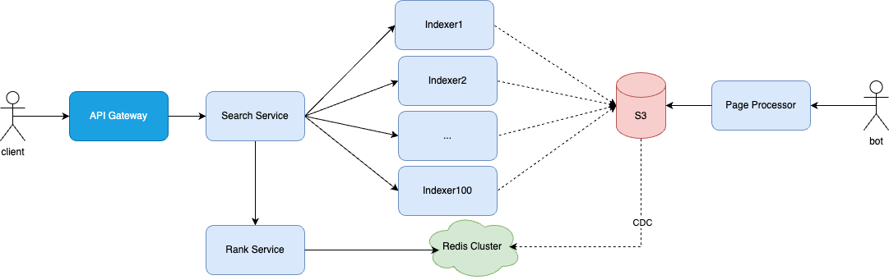
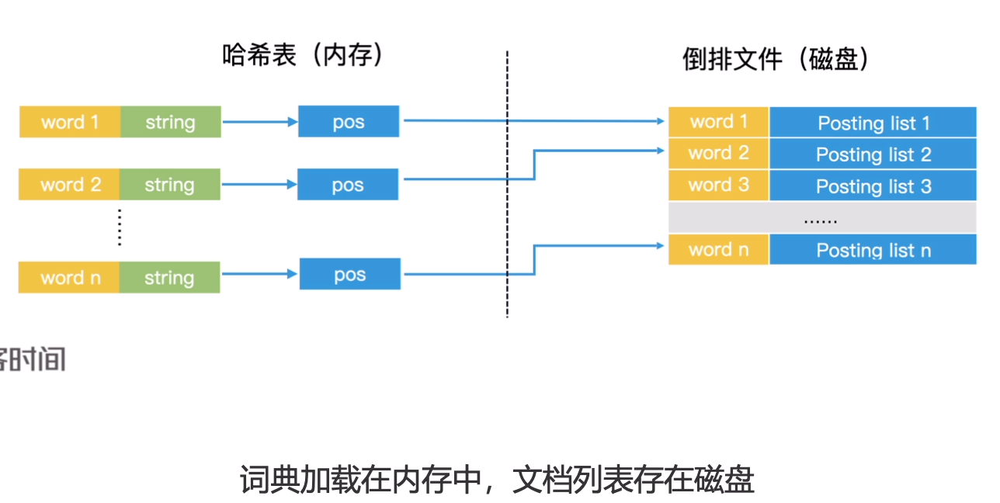

# 不足
1. 直接使用ES，但这样就无法做到按需定制，满足不了海量数据、高并发、高性能的场景
2. ES就是一个搜索引擎，是需要我们重新design一个。
3. ES会保存整个文档，而我们的场景是不需要保存整个文档的，只要知道对应文档的url，返回给用户就行了。
4. 搜索引擎不需要根据用户特征来返回文档，而是应该根据相关度，质量等静态特征。 （**那是推荐系统做的事**）

# system redesign

S3: 保存网页与关键词的映射关系：pageID -> {关键词1，关键词2...}； 以及网页的质量信息：pageID -> page score （页面质量得分）

Page Processor: 对爬取的网页进行分词与质量分析

Indexer 1~100: 分片保存倒排索引，启动的时候从S3中获取并构造对应的倒排索引

Redis Cluster：保存pageID -> page score信息 ，

Search Service：根据用户输入分词，然后向各个分片上搜索相关关键词的页面, 对于多个关键词的场景，还需要对搜索结果取交集。之后再调用Rank Service来对各个分片返回的结果进行排序。

Rank Service：对一些页面进行排序。（根绝page score）

# 小结
搜索引擎核心点有：
1. 索引拆分，加快查询速度。 （按docID或关键词分片）
2. 粗排：根据静态质量得分排序截断，根据词频得分排序截断，
3. 精排：TF-IDF,BM25,机器学习
4. 索引更新
5. 对两个倒排索引求交集：比如同时包含“高并发”和“架构”的网页才是符合搜索要求的结果， 数据分片 + 跳表