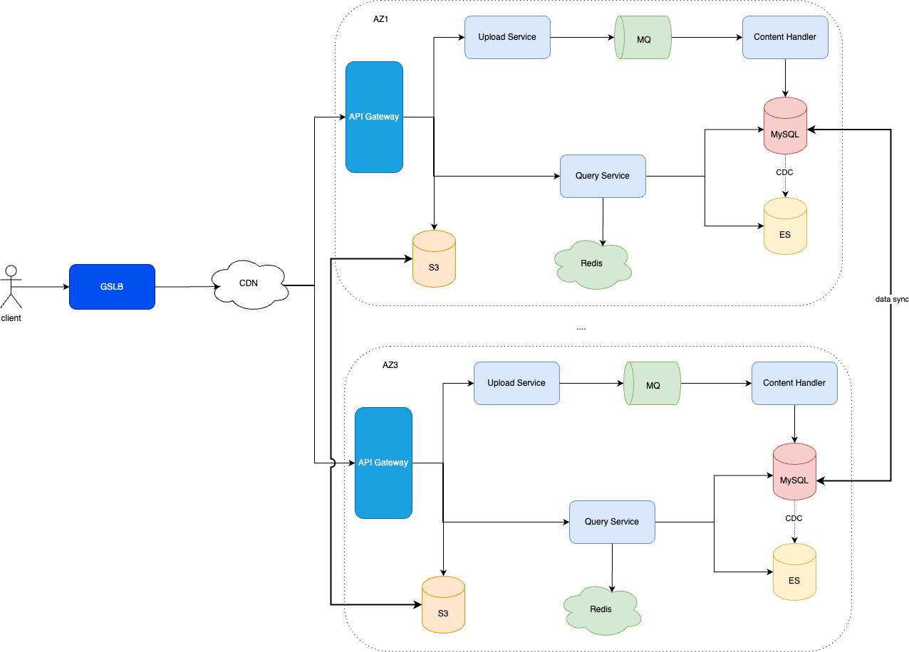

# 不足之处
1. CDN在架构中的位置弄错了，应该是在GSLB后面
2. 业务场景弄错了，百科属于根据title来查询对应的信息的
3. 没考虑图片的上传与存储
4. 没做缓存。 （缓存数据的内容尽量是应用服务器可以直接使用的完整数据，以减少应用服务器从缓存中获取数据后解析构造数据的代价。）

# system redesign

# Q&A
词条编辑者修改词条的时候，可能会同时修改（新增）词条文本和图片。而数据从主数据中心同步到多个从数据中心的时候，数据库同步可能和图片同步时间不一致，导致用户查看词条的时候，图片无法加载或者图片和文本内容不一致。如何解决？
1. Otter的做法是在数据同步的时候进行检查，如果有图片，就把数据和图片打包在一个同步块内进行同步，保证数据和图片是一致的。同时把这部分逻辑放在数据同步的时候实现，对正常业务流程没有影响，耦合性更加友好一点。(otter:阿里当年遇到并解决这个问题的系统)
