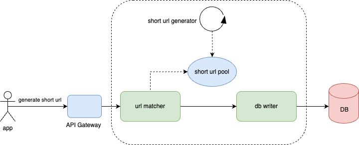
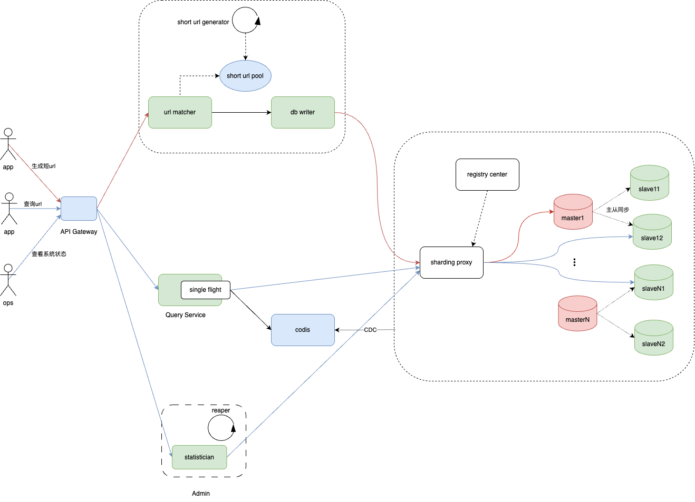

# 概要设计
## 实现原理
短 URL 生成器的设计核心就是短 URL 的生成，即长 URL 通过某种函数，计算得到一个 6 个字符的短 URL。短 URL 有几种不同的生成算法。
### 单项散列函数生成短 URL
通常的设计方案是，将长 URL 利用 MD5 或者 SHA256 等单项散列算法，进行 Hash 计算，得到 128bit 或者 256bit 的 Hash 值。然后对该 Hash 值进行 Base64 编码，得到 22 个或者 43 个 Base64 字符，再截取前面的 6 个字符，就得到短 URL 了，如图。

但是这样得到的短 URL，可能会发生 Hash 冲突，即不同的长 URL，计算得到的短 URL 是相同的（MD5 或者 SHA256 计算得到的 Hash 值几乎不会冲突，但是 Base64 编码后再截断的 6 个字符有可能会冲突）

所以在生成的时候，需要先校验该短 URL 是否已经映射为其他的长 URL，如果是，那么需要重新计算（换单向散列算法，或者换 Base64 编码截断位置）。重新计算得到的短 URL 依然可能冲突，需要再重新计算

但是这样的冲突处理需要多次到存储中查找 URL，无法保证 Fuxi 的性能要求。
### 自增长短URL
一种免冲突的算法是用自增长自然数来实现，即维持一个自增长的二进制自然数，然后将该自然数进行 Base64 编码即可得到一系列的短 URL。这样生成的的短 URL 必然唯一，而且还可以生成小于 6 个字符的短 URL，比如自然数 0 的 Base64 编码是字符“A”，就可以用 http://1.cn/A 作为短 URL。

但是这种算法将导致短 URL 是可猜测的，如果某个应用在某个时间段内生成了一批短 URL，那么这批短 URL 就会集中在一个自然数区间内。只要知道了其中一个短 URL，就可以通过自增（以及自减）的方式请求访问其他 URL。Fuxi 的需求是不允许短 URL 可预测。

### 随机数短URL
预生成短 URL 的算法可以采用随机数来实现，6 个字符，每个字符都用随机数产生（用 0~63 的随机数产生一个 Base64 编码字符）。
为了避免随机数产生的短 URL 冲突，可以在预生成的时候检查该 URL 是否已经存在（用布隆过滤器检查）。

短 URL 采用 Base64 编码，如果短 URL 长度是 7 个字符的话，大约可以编码 4 万亿个短 URL。
```shell
64^7≈4万亿
64^6≈680亿
```
按我们前面评估，总 URL 数 120 亿，6 个字符的编码就可以满足需求

## 简要总体架构


# 详细设计
分布式系统的核心是数据，所以我们先从数据存储开始设计。
## 存储设计
数据模型 
|short_url|origin_url|
|----|----|
|abcdef|https:baidu.com/tengxunshipingxxxx|

short_url添加唯一索引，方便查询与保障短url的唯一性。

预计每月新生成短 URL 5 亿条，短 URL 有效期 2 年，那么总URL数量为120 亿。因此可以选择MySQL分库分表，
也可以选择 NoSQL，eg:TiDB。
假设我们选择DB，则分库50，每个库200个表，这样每个表中有 120亿/（50*200）= 120w条数据。

同时，为了保障数据存储的高可用，我们对数据库采用了一主二从的部署方式。


register center用来配置后台MySQL数据库

## url generate service
基于服务高性能的考虑，采用预生成的方式来快速得到可用的短url。

预先生成一批没有冲突的短 URL 字符串，当外部请求输入长 URL 需要生成短 URL 的时候，直接从预先生成好的短 URL 字符串池中获取一个即可。

预生成短 URL 的算法可以采用随机数来实现，6 个字符，每个字符都用随机数产生（用 0~63 的随机数产生一个 Base64 编码字符）。
为了避免随机数产生的短 URL 冲突，需要在预生成的时候检查该 URL 是否已经存在（用布隆过滤器检查），冲突了直接丢弃该短url。
因为预生成短 URL 是离线的，所以这时不会有性能方面的问题。甚至，可以在上线之前就已经生成全部需要的 144 亿条短 URL 并存储在文件系统中（预估需要短 URL120 亿，Fuxi 预生成的时候进行了 20% 的冗余，即 144 亿。）

写的QPS并不高，直接将一条一条记录写入DB中就行



## query service

采用redis集群codis来缓存url数据，利用CDC数据分发技术同步DB中的数据变更同步到cache中，

每条短 URL 数据库记录大约 1KB，那么需要总存储空间 12TB（不含数据冗余备份）。Redis容量选用200G的，（采用LRU算法淘汰非热门数据）。
（对于 Redis 缓存内存空间估算，业界一般认为，超过 80% 请求集中在最近 6 天生成的短 URL 上，Fuxi 主要缓存最近六天生成的短 URL 即可。根据需求容量估计，最近 6 天生成的短 URL 数量约 1 亿条，因此需要 Redis 缓存服务器内存空间：1亿×1KB=100GB）


因为QPS/TPS = 100, 所以同时访问同一个url的并发量不小，采用请求合并single flight技术来访问缓存，缓存不存在时回源读取DB，并写入缓存。

获取到原始url后， 返回HTTP重定向响应，让用户可以重定向到原始URL。


## admin
管理端流量较少，查询简单，直接查询DB。
同时，启动一个reaper线程，定期删除过期的url。


## 总体架构


# 小结
首先，从详细设计上可以看出功能需求是符合的。接下来重点分析下非功能需求：
1. 高可用要求。该短url生成服务无状态，以集群方式部署，也很容易水平扩展，能实现高可用。另外，对于DB，我们采用了一主二从的部署方式，在主库挂了的情况下，可以将从库升级为主从，也能实现DB的高可用。因此，高可用是可以得到保障的。
2. 高性能要求。对于为长url生成短url的场景，因为生成短url采用预先生成唯一短url的方式，所以对于用户生成短url的请求耗时基本都在写入DB中，因为是ID自增的方式写，性能也会很好，能满足P99小于 20ms的要求。对于查询短url对应的原始长url的场景，因为缓存预加载，服务一般可以直接从缓存中获取，再加上有请求合并等技术防止DB负载过高，所以也能满足P99小于20ms的要求。
3. 规模大小要求。DB采用分库分表的方式，不仅容量规模可以满足要求，而且50个库也完全能够cover住4w QPS，跟别说有cache分担负载。
4. 短URL因为是通过随机数的方式生成的，所以也符合不可猜测的要求。

## 补充
2 万 QPS 看起来不小，但实际上，由于业务逻辑简单，单个数据都很小，加上大部分请求数据可以通过 Redis 缓存获取，
所以实际响应时间是非常短的，10ms 的平均响应时间使得 Fuxi 真正承受的并发压力只有 200。对于这样简单的业务逻辑以及 200 这样的并发压力，我们使用配置高一点的服务器的话，只需要一台短 URL 服务器其实就可以满足了。


基于利特尔法则（Little's law）得知，并发度 = QPS * 平均耗时，所以，2 万 QPS，10ms 平均响应时间，真正的并发量只有 200。

# 思考题
Q: 用户每次请求生成短 URL 的时候，Fuxi 都会返回一个新生成的短 URL，也就意味着，如果用户重复提交同一个长 URL 请求生成短 URL，每次都会返回一个新的短 URL。你认为这将导致什么问题？对此，你有什么解决方案？


A: 没有处理用户的重复请求。 
首先可以明确，一定程度上的重复生成是可以的。
考虑Redis中存储长链接 -> 短链接，或Md5（Redis中存储长链接）-> 短链接，并设定合理的过期时间，参考课程内容，貌似可以6天，或许1小时就可以。


Q: 为什么经过了MD5或者SHA256 hash之后还要再进行base64，不可以直接使用hash之后的结果吗？


A: MD5之类的编码包含不可见字符，没办法用于URL

