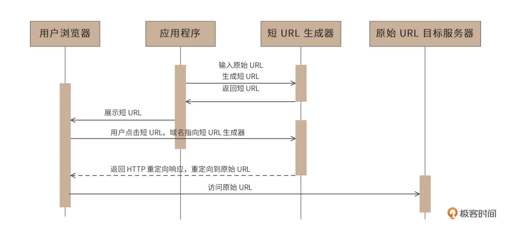
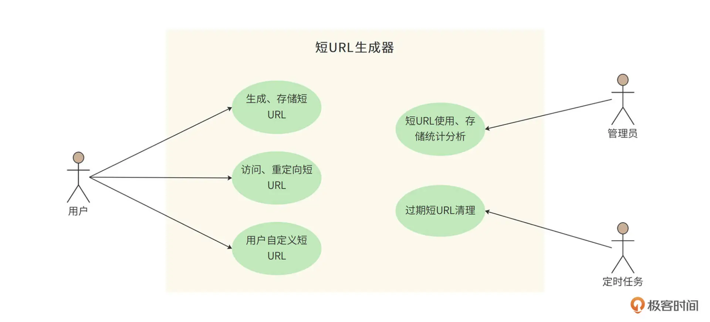

# 背景
在社交媒体上，人们经常需要分享一些 URL，但是有些 URL 可能会很长，比如：https://time.geekbang.org/hybrid/pvip?utm_source=geektime-pc-discover-banner&utm_term=geektime-pc-discover-banner

这样长的 URL 显然体验并不友好。我们期望分享的是一些更短、更易于阅读的短 URL，比如像 http://1.cn/ScW4dt 这样的。当用户点击这个短 URL 的时候，可以重定向访问到原始的链接地址。为此我们将设计开发一个短 URL 生成器

# 功能需求
短 URL 规模在百亿级别，并发吞吐量达到数万级别。
## 短URL生成器的访问时序图


## 短URL生成器的用例图

1. 用户 client 程序可以使用短 URL 生成器为每个长 URL 生成唯一的短 URL，并存储起来。
2. 用户可以访问这个短 URL，短URL生成器将请求重定向到原始长 URL。
3. 生成的短 URL 可以是短URL生成器自动生成的，也可以是用户自定义的。用户可以指定一个长 URL 对应的短 URL 内容，只要这个短 URL 还没有被使用。
4. 管理员可以通过 web 后台检索、查看短URL生成器的使用情况。
5. 短 URL 有有效期（2 年），后台定时任务会清理超过有效期的 URL，以节省存储资源，同时回收短 URL 地址链接资源。

# 非功能需求
1. 高可用，不因为服务器、数据库宕机而引起服务失效。 
2. 系高性能，服务端 80% 请求响应时间应小于 5ms，99% 请求响应时间小于 20ms，平均响应时间小于 10ms。
3. 规模大小, 预计每月新生成短 URL 5 亿条，即平均写200/s， 平均QPS=20000（读）。一般系统高峰期访问量是平均访问量的 2 倍，因此系统架构需要支持的QPS为40000
4. 短URL应该是不可猜测的，即不能猜测某个短 URL 是否存在，也不能猜测短URL可能对应的长URL地址内容。


# 下面的这些应该放到设计文档中去，尤其是DB设计

## 需求分析
预计每月新生成短 URL 5 亿条，短 URL 有效期 2 年，那么总 URL 数量 120 亿。
### 存储空间
每条短 URL 数据库记录大约 1KB，那么需要总存储空间 12TB（不含数据冗余备份）。
### 网络带宽
短 URL 的重定向响应包含长 URL 地址内容，长 URL 地址大约 500B，HTTP 响应头其他内容大约 500B，所以每个响应 1KB，高峰期需要的响应网络带宽 320Mb。
```shell
4万（每秒）次请求×1KB=40MB×8bit=320Mb
```

### 短 URL 长度估算
短 URL 采用 Base64 编码，如果短 URL 长度是 7 个字符的话，大约可以编码 4 万亿个短 URL。
```shell
647≈4万亿
646≈680亿
```
按我们前面评估，总 URL 数 120 亿，6 个字符的编码就可以满足需求

