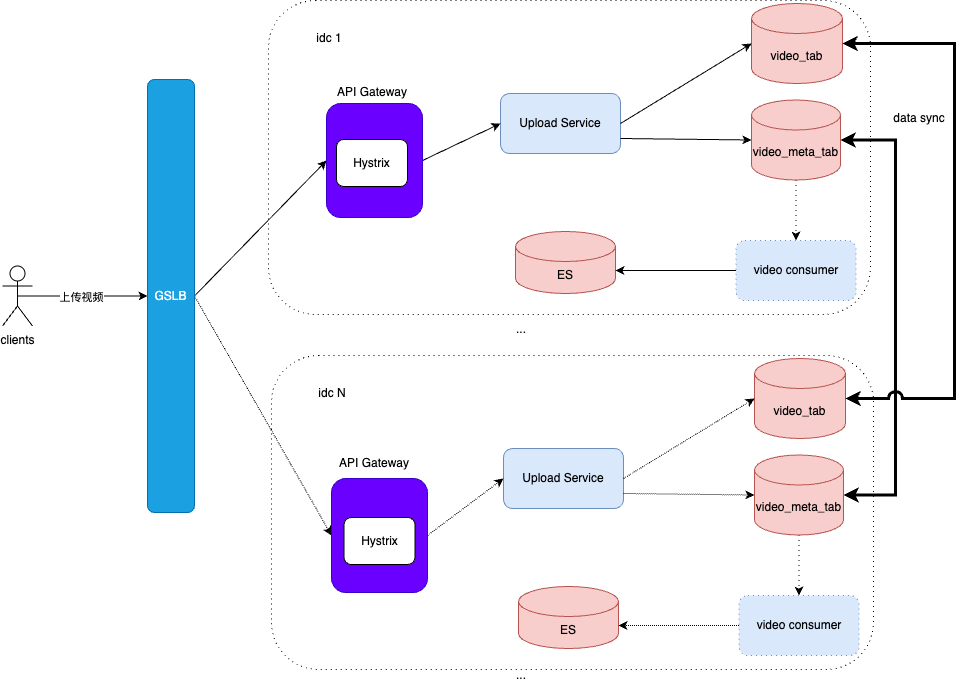
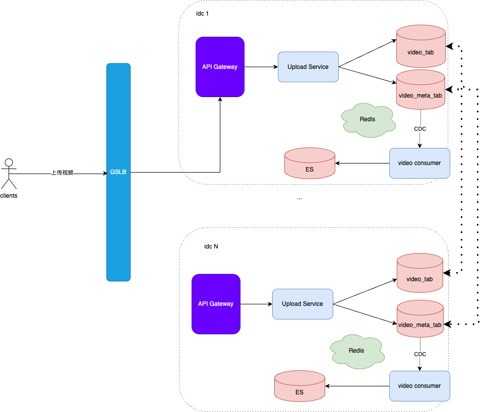

# 概要设计
## 实现原理
如何应对超高并发用户访问压力：
异地多IDC部署 + GSLB + CDN + 集中式缓存

如何存储海量的短视频文件：

每年新增视频量为：
```shell
550 x 3600 x 24 x 365 = 173亿
```
每年新增视频需要的存储空间为：
```shell
173亿 x 100M = 1700PB
```
1. 视频压缩, 虽然压缩不改变数据量级，但也能节约服务器成本
2. 多集群部署，比如每个idc部署100个HBase集群，每个集群只需要存储17PB的数据。 
3. 视频与集群的映射关系：根据hash(视频ID) % 100 的计算结果就是视频存储的集群ID。
此外，视频都是有时效性的，可以采用冷热分离的存储技术，将半年前或者一年前的视频归档存储至机器性能相对较差，但存储更大的集群中的。

## 简要架构


# 详细设计
## 存储设计
每个短视频大小约为100M，需对其拆分存储，拆分后的文件大小为1MB。
数据模型：


如上面实现原理中所介绍的那样，为了存储超大规模的视频数据，我们采用了多个HBase集群的方式来对用户视频进行存储。某个IDC中的存储架构如下图所示：


## Upload Service


GSLB会根据用户IP选择离他最近的IDC机房来对于用户上传的视频进行保存，同时也会讲上传的视频通过光纤同步到其它IDC中。这样，每个IDC都包含了全量数据，也能为任何一个用户服务，实现了异地多活。

## Query Service


当用户搜索视频时，GSLB会为用户请求路由到一个合适的IDC机房中，通过IDC中的API Gateway的简单处理，Query服务器就会根据用户的输入从ES中搜索出用户感兴趣的短视频，并将短视频相关的元数据（如：video_id, 视频title，description，分片信息等）从Redis或者video_meta_tab中读取，并返回给clients端,展示给用户。

当用户点击某个搜索视频，开始观看时，clients会先去CDN上获取对应的视频分片，如若CDN上有对应的视频分片, 则返回给clients，否则，CDB需要回源访问相应IDC的后台服务器，从video_tab中获取对应的视频分片，然后返回给clients，并保存在CDN服务器中。

借助CDC技术，所有视频的变更都会通过video consumer捕获并解析，然后将相应的视频数据写入ES中，供用户搜索。

## 总体架构


架构图中的API Gateway， Upload Service, Query Service都是无状态的，都是以集群的方式部署，可以根据负载状态，很方便的水平扩展/收缩集群规模。


因为平均每个活跃用户每天观看5min，我们可以假设每个用户每天的API请求数为100， 则QPS大约为115w/s。流量高峰期可以认为是平均的两倍，则我们的服务需要支撑的QPS为230w/s
```shell
10 亿 x 100 / (3600 * 24) = 115w
```
但因为有CDN的存在，承担了大部分的流量，可以假设打到我们服务的流量为总流量的1/10，则我们的每个IDC机房需要承担的QPS量为23w/s。
实际上，在API Gateway前面还有一层LB，可以采用F5来作为前置LB F5来支撑23w/s的高并发流量。
同时，为了防止个别恶意用户攻击服务，因此，在网关层采用Hystrix用户维度流量进行限流，以维护服务的稳定性。


上传视频的流程如下图所示：
1. 首先，client先将视频拆分成多个分片，然后调用后端API上传视频分片
2. GSLB会将上传视频请求路由到某一个IDC机房中，经过IDC中API Gateway的限流，安全性等检查通过后，API Gateway将其路由到某一台Upload service 服务器上。
3. Upload service服务器将视频分片，以及视频元数据信息存入对应的HBase集群中。 HBase集群中的数据会通过光纤同步到其它IDC机房中。
4. 同时，video consumer通过CDC技术监听到video_meta_tab的更新，将用户新增的视频元数据信息插入ES中，使得该视频能够被用户搜索。
5. 


搜索并观看视频的流程如下图所示：
1. client通过GSLB将搜索请求路由到某一个IDC中（比如idc1），经过idc1中的API Gateway检查通过后，被路由到某一台Query service服务器上。
2. Query service会根据用户输入的关键词，从ES中查询相关的视频ID。
3. Query service根据视频ID从redis中查询出相关的视频元数据（如视频ID，分片信息等），如果redis中没有，则回源到HBase的video_meta_tab中查询，并写入redis。
4. 然后，Query service就会将相关的视频元数据返回给clients。
5. 用户看到视频信息后，点击观看视频，client就会拿着视频的分片信息（如sub_video_id)，向CDN中请求对应的视频分片内容。
6. 如果CDN中恰好有该视频分片，则直接返回给clients，开始播放视频给用户看。否则，继续下一步，回源到我们的后台服务器集群来获取视频分片。
7. CDN回源请求经过GSLB路由到idc1中，再经过API Gateway检查通过后，路由到我们的某台Query Service服务器上。
8. Query Service从对应的HBase集群的video_tab中将视频分片取出来，返回给CDN。
9. CDB保存该视频分片，并返回给clients，这时候clients就可以开始播放视频了。


# 系统小结

