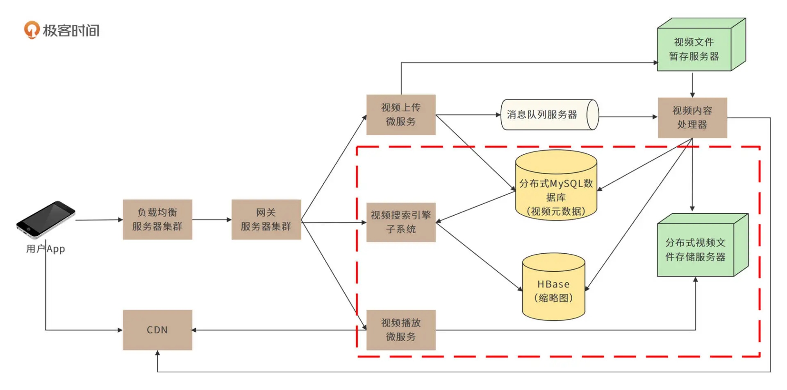
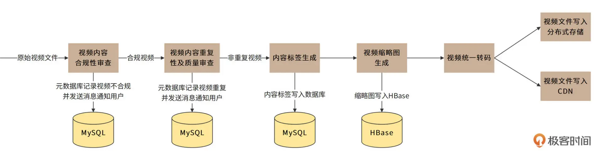
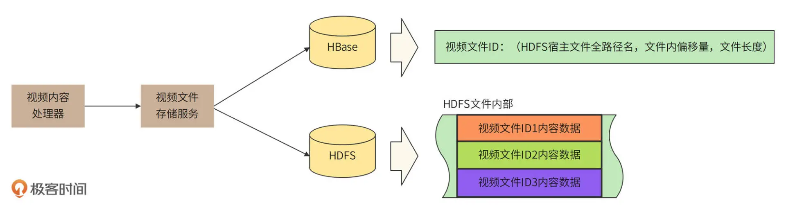
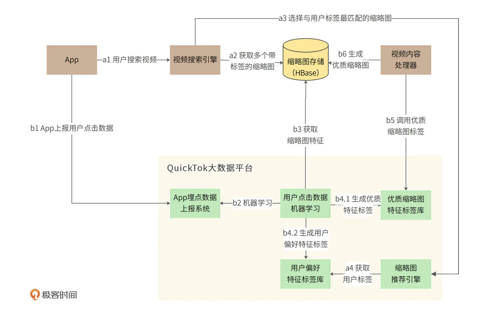
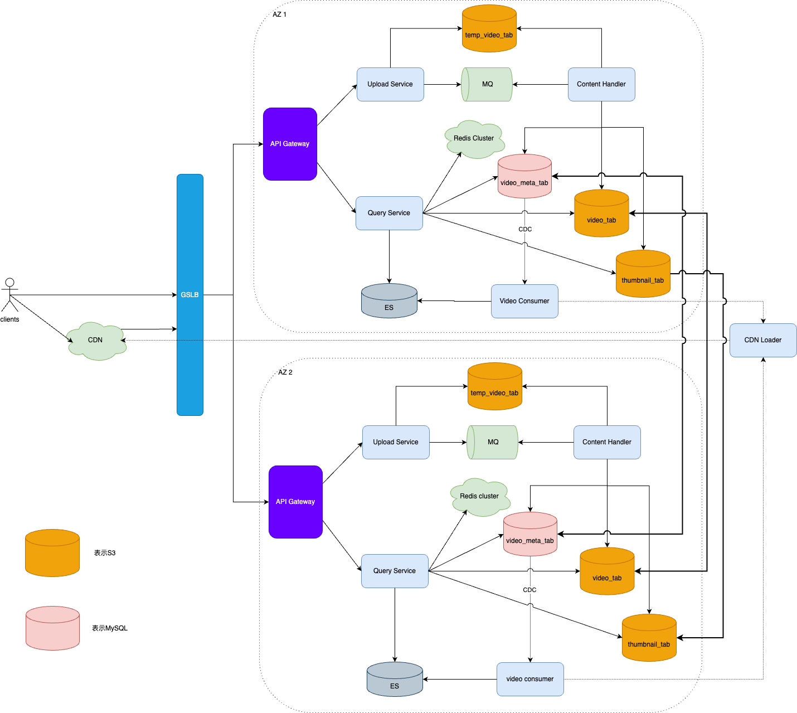

# 考虑不周的重难点
视频文件和普通文件的特点不一样，有很多视频文件特有的点没有想到，但也有一些共通的设计点也没想到。
## 1.视频内容处理
这个应该是视频和其它文件最不一样的一个点，视频需要有很多处理：
1. **内容合规性审查**
2. **内容重复性及质量审查**
3. **内容标签生成**
4. **视频缩略图生成** （**特有**）（普通文件也有，比如百度搜索结果列表）
5. **统一视频转码处理**（**特有**）：一种是用户上传的不同的视频编码格式需要统一转码成平台格式；一种是转码成不同清晰度的视频文件，根据用户带宽和会员等级进行传输。

实际上，不管是短视频平台，还是小红书这样的社区分享平台，抑或是知乎类的文档分享平台，都需要进行内容处理，比如上面的前三点处理是所有类型的文件分享平台都需要做的。

视频内容处理架构设计可以参考下面的设计：

视频内容处理一般都是在后台进行的，这就意味着我们需要有消息通知机制来触发视频内容处理流程，所以一般做法都是采用MQ。但对于文件、图片、视频这类数据量都太大，一般的MQ都没法支持这么大的消息，比如Kafka中消息的最大值上限为10 MB，（最佳大小为10K）虽然可以通过配置修改，但会影响性能。
因此，我们需要将文件存储到比如对象存储系统S3等，而只需要将文件id等相关元数据发送给kafka。 其它文件内容处理架构应该也是类似的。

为什么不直接将文件发送给视频内容处理服务器？ 
1. 和使用MQ是一样的道理，就是为了削峰、解耦。
2. 视频内容处理服务器暂存过多文件，一方面消耗过多资源，另一方面违反了单一职责原则。

视频内容处理器是一个由责任链模式构建起来的管道。在这个管道中，视频将会被顺序进行内容合规性审查、内容重复性及质量审查、内容标签生成、视频缩略图生成、统一视频转码处理等操作，如下图所示：

## 2. 流媒体传输协议进行视频传输
MPEG–DASH 流媒体传输协议可以进行视频流传输，因为这个协议具有自适应能力，而且支持 HTTP，可以应对 QuickTok 的视频播放需求。其实不止是视频，音乐也可以适用类似的流媒体传输协议。

所谓的流媒体传输协议其实都是把视频分割成一小段一小段， 通过HTTP协议进行传输，客户端得到之后进行播放；其实就是和把文件切分成很多分片，这样就可以下载一个小分片就能开始播放，而不用等到整个大的文件都下载下来才能播放。

这样也就省去了我在系统设计里的视频文件分片的设计部分，简化系统设计。而网盘系统因为是普通文件，就无法用流媒体传输协议，只能自己设计分片了。

所以，无论是哪种文件，分片是必须的，只是视频、音乐等流媒体是业界已有现成的协议来处理，普通文件就只能我们自己来处理分片逻辑了。

## 3. 实时系统竟也可以采用HDFS来存储
HDFS 适合存储大文件，大文件减少磁盘碎片，更有利于存储空间的利用，同时 HDFS NameNode 的访问压力也更小，所以我们需要把若干个视频文件合并成一个 HDFS 文件进行存储，并将存储相关的细节记录到 HBase或其它存储中。

视频、图片等存储其实是一种典型的对象存储，可以使用Ceph、S3等对象存储系统来存储，而且实际上就有不同的公司采用不同的存储系统：
根据公开资料，快手用了HDFS，而YouTube早期用了Amazon S3来存储短视频。

只不过用HDFS就得注意文件合并存储，因为HDFS适合存储大文件。而且这是因为有CDN的存在，从而大大缓解了HDFS性能带来的影响。

## 4. 主动推送CDN
短视频业务容易出现热点，因此对于热点视频预先主动推送CDN，进一步提升应用的整体性能。

怎么预先知道是热点视频：大 V、网红们发布的短视频会被更快速、更广泛地播放。因此针对粉丝量超过 10 万的用户，系统将采用主动推送 CDN 的方法。

CDN一方面可以极大加快用户请求的响应速度，另一方面又可以较大缓解数据中心的网络和硬盘负载压力。业界一般共识，视频应用 CDN 处理的带宽大约占总带宽的 95% 以上，所以到达我们后台服务的流量只有5%。

## 5. 缩略图生成与推荐设计
用户可以通过 App 主页、搜索结果页、视频推荐页等页面看到视频列表，其中每个视频都需要有个缩略图。用户点击缩略图，就开始播放视频。

不管是视频，还是普通文件，搜索结果展示应该都是展示是的缩略图。图片生成缩略图的目的有点不一样：主要是基于图片大小考虑，小图片加载快。

缩略图通常是由视频的某一帧画面缩略而生成的。事实上，缩略图的选择会极大地影响用户点击、播放视频的意愿。
一个 10 分钟的视频大约包含 3 万帧画面，选择哪一帧画面，才能使用户点击视频的可能性最大？以及，针对不同的用户分类，是否选择不同的缩略图会产生更高的点击率？

可以通过大数据平台的机器学习引擎来完成缩略图的生成和推荐

缩略图的生成和推荐可以分为两个具体过程：
1. 实时在线的缩略图推荐过程 a；
2. 利用离线机器学习生成优质缩略图的过程 b。

那最开始没有特征库的时候怎么办呢？视频内容处理器可以使用随机的办法，抽取一些帧作为缩略图，进行冷启动。机器学习再从这些随机抽取的缩略图上开始学习，从而进入循环优化过程。

## 6. 标签也要引入搜索引擎
根据用户提交的视频标题、上传用户等元数据，以及视频内容处理器生成的内容标签构建倒排索引

## 7. 存储选型不太合理
元数据应该选用MySQL分库分表，而不是HBase。因为每年新增170亿个视频，百亿级别行数超过了HBase的存储能力。而MySQL分库分表是可以支持的，比如20个库，每个库500个表。

视频数据应该选用Ceph/S3 对象存储或者HDFS，而不是HBase，文件存储一般都会选用对象存储或者文件系统存储。

# system redesign

CDN：缓存视频文件，用户播放视频的请求会先到达CDN获取对应的视频文件，如果有，则直接返回给用户；否则，CDN会回源到后台服务器，获取对应的视频，并缓存起来。（一方面承担大部分用户流量，为后台服务器减负（服务器负载和网络负载）， 另一方面提升用户体验，经过CDN缓存的视频，能更快的发送给用户，因为CDN离用户更近。）

GSLB：全局服务器负载均衡，将客户端请求路由到离其最近的AZ。

API Gateway：路由，限流，权限，安全治理。将用户流量路由到某一台服务器上。

Upload Service： 处理用户上传视频请求，核心操作是：首先将用户上传的视频暂存到s3对象存储中，然后将视频的元数据以及S3返回的视频存储ID打包成消息发送到MQ中。

temp_video_tab： 将用户视频请求临时保存，供视频内容处理器对视频内容进行处理加工。

Content Handler： 视频内容处理器，是一个由责任链模式构建起来的管道：内容合规性审查 -> 内容重复性及质量审查 -> 内容标签生成 -> 缩略图生成 -> 视频转码。 
处理完成后，将视频和缩略图分别写入S3的不同bucket中，将数据元数据（包括视频存储id，视频缩略图存储id）写入MySQL中。

video_meta_tab： MySQL分库分表，存储视频元数据（包括视频存储id，视频缩略图存储id）。

video_tab： S3，存储视频文件。

thumbnail_tab： S3，存储视频缩略图。

Redis Cluster： 缓存视频元数据

Video Consumer：通过CDC技术监听视频元数据变更信息，一方面将视频元数据信息插入ES中，构建倒排索引，以支持视频搜素功能； 另一方面，对于很有可能成为热点的视频（比如大V发布的视频），通过调用CDN Loader，
主动将该视频加载到CDN中。

ES：将视频信息（包括视频名称，视频描述，以及视频标签）构建倒排索引，以便支持视频搜索功能。

Query Service：提供视频搜索服务，会根据用户输入的关键词，从ES中查找相关的视频id列表，然后根据视频id列表从Redis cluster获取对应的视频元数据，
如果没有，则从video_meta_tab和thumbnail_tab表中获取对应的视频元数据，返回给用户，同时也通过cache aside的方式将视频元数据写入Redis cluster。 
除此之外，也提供视频下载服务，根据用户传过来的视频id，从S3中获取对应的视频文件，发送回client。

CDN Loader：主动刷新CDB缓存，预先加载视频。

# 总结
1. 不只是视频，文件和图片也都有缩略图的概念，其实只要是需要展示给用户看到的，为了性能考虑，一般都是会有缩略图。
2. 不只是短视频平台，文件、电商等平台也都有内容处理的环节，来规避很多风险，以及为用户提供更好的服务。
3. 视频文件不需要分片，因为有流媒体协议的存在。
