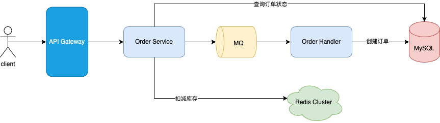

# 实现原理
Apollo 的核心挑战是：
如何应对突然出现的数百倍高并发访问压力？
1. 缓存 + 预热。使用CDN， redis，浏览器/app本地缓存等分摊请求到后台服务器和DB的流量负载
2. 异步处理。对于无法用缓存处理的写请求，则采用异步处理的方式，处理完成后通知用户写请求的处理结果。
3. 用户维度限流。

如何保证用户只有在秒杀开始时才能下单购买秒杀商品？
1. 后端服务对商品秒杀活动开始时间判断，开始前禁止拦截下单请求。
2. 在秒杀开始前，前端禁用对秒杀商品的下单按钮
3. 在秒杀开始后，详情页开始下发秒杀开始的secret，只有带有该secret参数的下单请求才是正常的请求。

# 概要设计

Detail Service: 提供秒杀商品详情查询服务

Order Service: 提供商品下单服务。
# 详细设计

## 存储设计
数据模型如下：

MySQL保存上面er图中描述的活动信息，商品的信息，以及活动与商品的映射关系。
S3则存储商品图片，视频等信息。

因为要是保障高可用和高并发，所以选一主二从的方式来部署MySQL。而秒杀的数据规模不会很大，所以单库单表应该就够用了，存储设计如下：

## Admin

通过调用Admin服务来设置秒杀活动。因为流量不高，采用直接写DB的方式。 对于运营设置的秒杀活动的图片，视频等，由前端直接保存到S3中，MySQL只需要保存图片和视频存储id。

## Detail Service

Load service：在活动开始前1h，Load service会主动将秒杀商品图片、视频等数据量较大的信息事先加载到CDN中，同时，也会将MySQL中相关的秒杀商品信息加载redis cluster缓存中。

Detail Service：负责查询相关的秒杀活动信息，先从Redis Cluster中获取，如果没有，则会通过cache aside的方式从MySQL中获取，并写入Redis Cluster中。

S3： 保存秒杀商品的图片、视频等数据量较大的信息。

商品详情查询流程：
1. 用户通过网关请求秒杀商品信息，Detail Service收到请求后，查询Redis cluster，获取该商品信息，如果Redis中没有则会去MySQL中获取，并缓存到Redis。
2. 用户获取到秒杀商品信息后，会将商品的图片ID、视频ID请求CDN，如果CDN中有该图片和视频，则直接返回，前端将该图片、视频渲染。否则，继续下一步
3. CDN访问S3获取对应的图片和视频，并将其缓存当CDN中，然后返回给前端。

## Order Service

Order service：通过责任链模式构建管道来处理用户下单请求：下单去重 ->  库存校验 -> 扣减库存 -> 发送到MQ； 同时也给前端提供了一个API来查询当前用户的订单状态（是否抢购成功）。

Order Handler：根据用户请求，创建订单，如果db中库存不够，则创建失败。创建订单 与 在db中扣减库存需要事务保障。

Redis cluster：保存秒杀商品的当前库存，Order service会根据该库存来判断用户是否秒杀成功，如果库存已经<=0, 则会直接返回告诉用户，秒杀失败。如果库存>0, 则扣减库存（**用lua脚本的方式，redis原子性保障**）。
为了减少Redis单机压力，可以将秒杀商品库存的保存在多个key上，每个redis key保存一部分库存。

下单流程：
1. 用户下单，Order service通过Lua脚本的方式调用Redis Cluster扣减库存，如果该秒杀商品的剩余库存 <= 0, 则返回存库扣减失败给用户。否则，库存扣减成功，继续下一步。
2. 将请求包装成消息发送到MQ中，并返回给前端，让其给用户展示等待页面，并过几秒来查询商品秒杀结果。
3. Order Handler调用MySQL执行扣减库存， 以及创建订单操作，这两步需事务执行。如果扣减库存失败（库存不能 < 0), 则创建失败的订单。
4. 前端等待几秒后（比如2s），再项Order Service发起用户订单状态查询，Order Service根据DB中该用户的订单状态返回告诉前端是否抢购成功的结果。

## 总体架构

API Gateway: 限流、路由、安全、权限检查等。

Redis Cluster: 1. 缓存秒杀商品短期内不会频繁变化的的部分。 2. 缓存秒杀商品频繁变化的stock （分多个key存储）。

# 设计小结
秒杀系统主要就是两个接口，一个是查询秒杀商品信息，另一个就是下单扣库存。其中，查询是可以预热+缓存的方式来分摊大部分流量，对数据一致性要求是最终一致性。

下单扣库存瞬时高并发写，一方面可以通过Redis Cluster来承担扣减库存的大流量，另一方面，对于扣减库存成功的那部分流量（TPS约等于库存量），通过MQ来削峰，异步执行创建订单操作，然后由前端来轮训下单结果。
这样基本上就可以以较低的成本扛住百倍于平时的流量。

还有一点是需要做好限流，虽然说秒杀（营销）的目的在于吸引流量，但超过一定量的流量可能有害无益。

风控也是需要的，防范黑产。

# Q&A
Q1. 前端如何识别一个商品是否为秒杀商品？
通过给商品id上加秒杀tag

Q2. 库存通过拆分成多个key保存在redis cluster上，如果保障不少卖，不超卖？
1. 不超买，通过创建订单 + 扣减DB中的库存的事务性操作来保障。
2. 不少卖，可以通过将保存在redis cluster上的库存数量翻倍这种方式来保障。

Q3. 为什么采用客户端轮询的方式查看秒杀结果呢？
1. 方式一般有两种，除了轮询，还有一种就是服务端推送秒杀结果，HTTP 2支持双向通信，可以满足推送的功能，
2. 但问题在于，如果采用推送的方式，那连接就不能释放，这条连接所占用的资源就会一直持有，在高并发场景下，可能耗尽系统资源