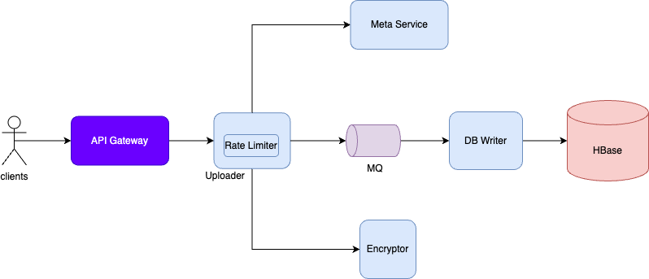
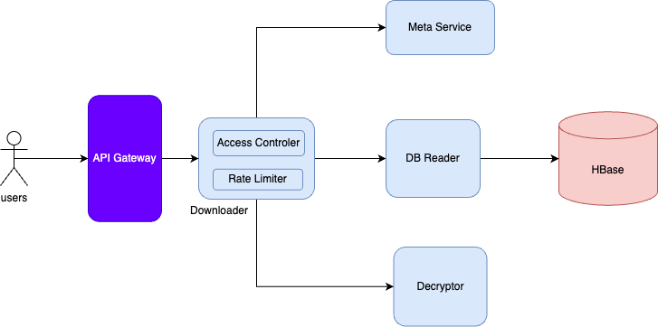
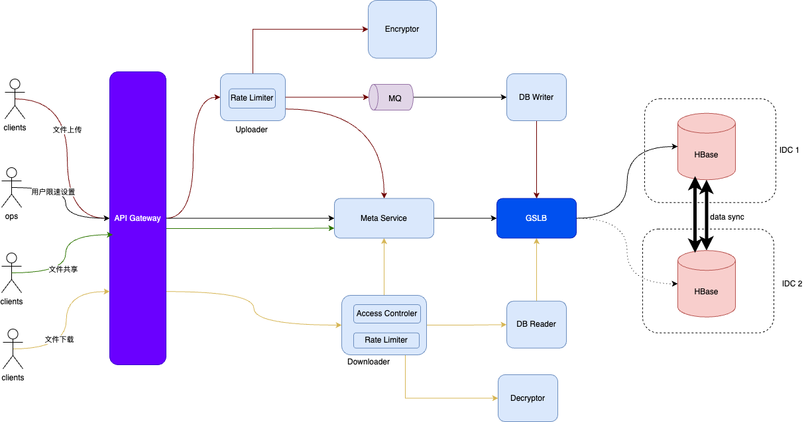

# 概要设计

## 实现原理

1. 可以通过HTTP1.1 长连接协议来实现文件上传和下载 (chunked模式)
2. 断点续传功能可以通过已下载文件的offset来实现。
3. 共享功能可以通过用户分享一个唯一ID来实现，被分享的用户可以拿着这个ID是下载分享用户的共享文件。
4. 流速控制可以通过控制用户上传/下载文件中的相邻两部分数据的间隔时间来控制流速。如果是vip用户，可以把间隔时间调的更低，或者取消，甚至可以为vip用户单独搭建特殊集群。
5. 秒传功能可以通过md5等hash函数来判断文件是否已存在云盘，从而实现秒传。

## 简要架构


# 详细设计

## 存储设计

理论上，总存储空间估算为 10 亿 TB，即 1 万亿 GB。

```shell
10亿×1TB=10亿TB
```

但考虑到大多数用户并不会完全用掉这个空间，还有很多用户存储的文件其实是和别人重复的（电影、电子书、软件安装包等），真正需要的存储空间大约是这个估算值的
10%，即 1 亿 TB。

因为是TB级别大规模数据存储，且要求存储可靠性达到6个9的考虑，因此，采用NoSQL HBase来存储用户文件。

数据模型如下所示
|file_id|file_data|file_md5|
|----|----|----|
|xxx|xxxxx|xxx|

## meta service

meta service的主要功能有：
1. 管理用户访问文件的权限
2. 管理用户上传/下载速度
3. 管理用户文件共享下载

数据模型如下所示
｜user_id|file_name|file_id|rate_limit_level|upload_rate_limit|download_rate_limit|shared_id|
|----|----|----|----|----|----|----|
|xxx|xxxx|xxxx|xxxx|xxxx|xxxx|xxxx|

基于用户量庞大，且减少使用不同技术栈的考虑，选用HBase来存储用户信息。

meta service的设计如下图所示：


## upload service

因为要对上传限速，所以需要client端，也就是app或者web前端将文件分片后再上传。 upload service每接收到一个文件分片，就休眠一会（eg：100ms），通过这种方式来对上传进行限速了。

其实，这种通过服务端对上传限速的方式会有一些问题，容易导致客户端超时重试，从而对网络造成额外的负担。也可以让客户端来限速，每上传完成一分片的数据，就休眠一会，再上传，这种方式安全性可能没那么好，限速容易被破解。

因为http协议对于大文件，如果clients端不将文件分片，选择chunked或者content-length方式来分片上传文件，但是http在接收端是会将文件拼接好之后才会提交给接收端的，这样就不好对上传进行限速。

upload service不仅要上传文件，还要将文件的访问者权限等写入meta service中，从而实现访问权限控制。

秒传功能通过判断上传文件的md5是否已存储在HBase中来实现。如果md5已存在HBase中，则表示该文件已上传，不需要重复上传该文件，只需要将用户的访问权限与文件信息写入meta service中就可以了。
## download service

共享文件下载通过用户上传的共享ID来判断，该文件是否是文件owner共享出来的ID，如果是，则表示拥有该ID的用户也有下载该文件的权限。

断点续传则是通过offset来实现，每次download service返回给client一部分数据，也会把该数据对应的offset一起返回给client，这样客户端就能知道当前已下载的进度offset，
如果有问题下载被中断了，等下次重新开始下载的时候，客户端可以将该offset上传只server端，download service就会根据offset来返回未下载完成的部分。

下载速度限制也是通过在server端每接收到一分片数据，休眠一会的方式来实现。其实，采用server端push模式可能对限速这个场景更合适，就是在client端向server端发起下载请求后，server端主动将分片数据发给client端。不过这样就不能使用http协议了，因为http只支持单向通信。


## 总体架构



# 架构小结

