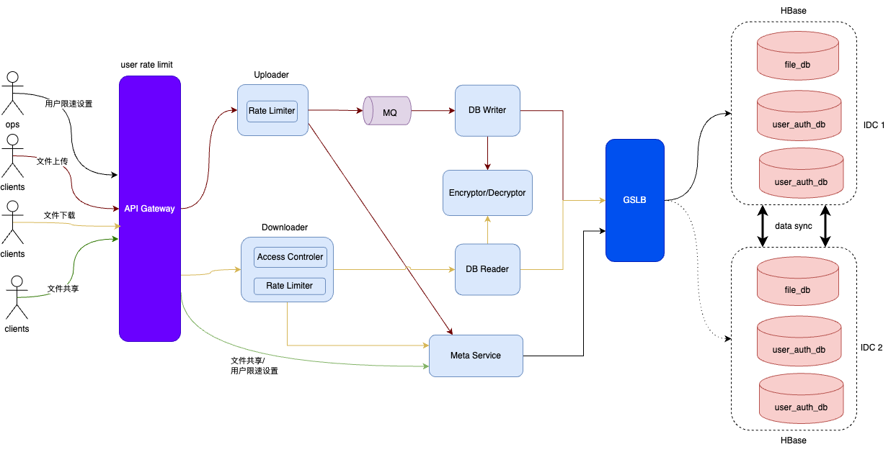

# 设计不足之处
1. 没有考虑到用户文件存储也是需要拆分，因为用户可能上传一个很大的文件，比如100G的文件，大部分存储系统应该都做不到直接将这么大的数据直接存储。就算存储系统能支持，但这么大的数据在传输中，或者存储系统保存的时候出现一点小问题，就需要将这么大的数据重新再是一次（因为存储系统一般都没有断点续传的功能），容易耗尽系统资源。
2. 服务端不应该处理文件拆分/合并的操作，因为client应用端也有拆分逻辑，server端有合并逻辑，造成了client端和server端逻辑冗余，且难维护。
3. 对各种大规模数据存储系统，不是很了解其各自的特性，存储选型没有经过调研而匆忙决定。
4. 限速设计的方式会对系统资源造成浪费，不应该对一个正持有大文件的线程休眠，应该等线程释放大文件资源后再休眠。
5. 系统可用性不足，对于资源紧张（付费）的系统，应该合理隔离各个用户的资源使用，避免个别用户影响大部人用户的体验，应该进行用户维度的限流。

# system redesign
为了解决之前的设计中存在的问题，这次在原来的设计上重新修改了设计方案，修改后的系统架构图如下所示：

通过对HDFS，HBase，Ceph等分布式存储系统进行分析后发现，其实HDFS是最符合这个系统的使用场景的，但是如果使用HDFS了，那么可能这个设计题就没有出的必要了。至于HBase和Ceph，其实这两个都可以满足要求，只是HBase相对来说更熟悉些。

改动主要有以下几点：
1. 文件的拆分与组装全部由client端app来完成，服务端只负责告诉clients端其目标拆分小文件数量。约定每个拆分文件大小为10M。
2. 增加了用户文件元数据表，该表保存了用户文件与拆分后各个小文件的映射关系，具体数据模型展示在本文最后。
3. 限速由server端来控制：一是通过用户上传/下载文件到HBase/MQ中的并发度来控制， 二是通过每个线程中发送并释放一个小的拆分文件后，是否休眠来控制速度。
4. 防止个别用户影响系统，在API Gateway引入了Hystrix来实现对用户维度的访问限流。

# 补充
文件元数据表如下所示：
|file_id|file_md5|split_num|
|--|----|----|
|xxxx|xxxx|xx|

