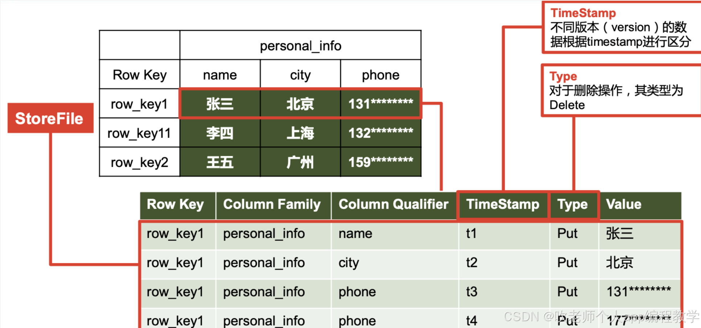
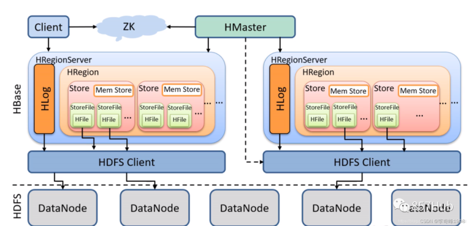
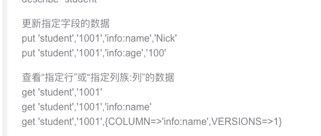

# 设计不足之处
1. 没有考虑到用户文件存储也是需要拆分的问题，因为用户可能上传一个很大的文件，比如100G的文件，大部分存储系统应该都做不到直接将这么大的数据直接存储。就算存储系统能支持，但这么大的数据在传输中，或者存储系统保存的时候出现一点小问题，就需要将这么大的数据重新再是一次（因为存储系统一般都没有断点续传的功能），容易耗尽系统资源。
2. 服务端不应该处理文件拆分/合并的操作，这样造成的了没必要的文件拆分/合并，浪费资源。而且因为client应用端也有拆分逻辑，server端有合并逻辑，造成了client端和server端逻辑冗余，且难维护。
3. 对各种大规模数据存储系统，不是很了解其各自的特性，存储选型没有经过调研。
4. 限速设计的方式会对系统资源造成浪费，不应该对一个正在处理大文件的线程休眠，应该等线程释放大文件资源后再休眠。
5. 对于资源紧张（付费）的系统，应该合理隔离各个用户的资源使用，避免个别用户影响大部人用户的体验，这也是没考虑到的，应该对用户维度进行限流。

# 大数据存储系统
## HDFS
HDFS是一个分布式文件系统，采用主从架构，主要由NameNode和DataNode两类节点组成，NameNode是HDFS的主节点，负责管理文件系统的命名空间和文件快的映射关系。
它存储所有文件和目录的元数据（如文件名、权限、块位置等），并协调客户端对数据的访问请求。DataNode是HDFS的工作节点，负责存储实际的数据块。
具有一下优点：
1. 高容错：副本机制
2. 高吞吐：批量
3. 可扩展性：添加节点，轻松扩展HDFS的存储容量

### HDFS的工作原理
HDFS通过分布式存储和冗余机制，实现高可靠性和高可用性。

文件存储：HDFS将文件分割成固定大小的块（默认64MB或128MB），并将这些块存储在不同的DataNode上。每个块会被复制到多个DataNode，以确保数据的可靠性。

数据写入：当客户端向HDFS写入数据时，数据首先被分割成块，并通过Pipeline机制写入到多个DataNode。具体步骤如下：
1. 客户端请求NameNode：客户向NameNode请求写入文件
2. NameNode分配块和DataNode：NameNode为文件分配数据块并选择存储这些块的DataNode
3. 客户端写入数据块：客户端将数据块写入第一个DataNode，第一个DataNode再将数据块复制到第二个DataNode，以此类推
4. 数据块确认：当所有副本写入成功后，客户端接收到确认消息，表示数据写入完成。

数据读取：当客户端从HDFS读取数据时，NameNode提供数据块的位置信息，客户端直接从相应的DataNode读取数据。具体步骤如下：
1. 客户端请求NameNode：客户向NameNode请求读取文件
2. NameNode返回块位置：NameNode返回文件块所在的DataNode列表
3. 客户端读取数据块：客户端直接从DataNode读取数据块，并在本地合并这些数据块，恢复成完整的文件。

### 应用场景
数据仓库、日志存储与处理、多媒体存储（如图像、音频和视频文件等）。

### 操作命令
（put)将本地文件上传到HDFS： hdfs dfs -put 本地文件  **/路径**

（get)从HDFS下载文件到本地： hdfs dfs -get **/路径** 本地文件

⚠️注意：文件系统HDFS的存储的key是文件路径

## HBase
HBase是一个分布式的基于列式存储的数据库，它采用hdfs存储，zookeeper进行管理。HBase虽然还是以HDFS作为文件存储，但是它存储的数据不再是简单的文本文件，
而是经过HBase优化压缩过的二进制文件，所以它的存储文件通常是不能够直接查看的。
### 数据模型
NameSpace：类似于关系型数据库的DataBase概念，咩哥命名空间下有多个表。

Table：类似于关系型数据库的表的概念。不同的是，HBase定义表时只需要声明列族即可，不需要声明具体的列。这意味着，往HBase写入数据时，字段可以动态，按需指定。因此，和SQL数据相比，HBase能轻松应对字段变更的场景。

Column：HBase中每个列都由Column Family（列族）和Column Qualifier（列限定符）进行限定。建表时，只需指明列族，而列限定符无需预先定义。

Timestamp：用于表示数据的不同版本，每条数据写入时，如果不指定时间戳，系统会自动为其加上该字段。

Cell：由{rowkey, column Family:column Qualifier, timestamp} 唯一确定的单元，cell中的数据是没有类型的，**全部是字节码形式存储**。

### 架构
HBase是主从架构，Master作为主节点，Regionserver作为从节点

Zookeeper： Master 的高可用、RegionServer 的监控、元数据的入口以及集群配置的维护等

HDFS： 提供底层数据支撑

Master： 监控RegionServer，进行负载均衡；
RegionServer故障转移；
处理元数据变更；
处理region的分配或分裂；
处理增删改查请求；

RegionServer：负责存储HBase的实际数据；
管理分配给它的Region；
刷新缓存到HDFS；
维护Hlog；
执行压缩；
负责处理Region分片；

Region： 实际存储数据，HBase表会根据RowKey值被切分成不同的region存储在RegionServer中，在一个RegionServer中可以有多个不同的region

Hlog： 预写日志WAL，用于记录HBase的修改记录

MemStore： 写缓存

StoreFile： 这是在磁盘上保存原始数据的实际的物理文件，是实际的存储文件。StoreFile是以Hfile的形式存储在HDFS的

### HBase特点
1. 大： 一个表可以有数十亿行，上百万列；
2. 无模式： 每行都有一个可排序的主键和任意多的列，列可以根据需要动态的增加，同一 张表中不同的行可以有截然不同的列； 
3. 面向列： 面向列（族）的存储和权限控制，列（族）独立检索； 
4. 稀疏： 空（null）列并不占用存储空间，表可以设计的非常稀疏； 
5. 数据多版本： 每个单元中的数据可以有多个版本，默认情况下版本号自动分配，是单元 格插入时的时间戳； 
6. 数据类型单一： Hbase 中的数据都是二进制存储，没有类型。

### HBase操作

### HBase适用场景
HBase虽然是基于HDFS来存储数据，但是他存储的数据都是经过自己优化索引后的数据，所以它对数据的存储是非常高效的。HBase以类似Redis的列式存储来管理数据，对数据的增删改查都非常高效，可以达到ms级别。
所以它完全可以作为传统意义上的数据库使用，适用于**大部分的OLTP的场景**。

## Ceph
对象存储：也就是**通常意义的键值存储**，其接口就是简单的GET、PUT、DEL 和其他扩展，代表主要有 Swift 、S3 以及 Gluster 等。

Ceph也支持块存储，和文件系统存储。

# system redesign
为了解决之前的设计中存在的问题，这次在原来的设计上重新修改了设计方案，修改后的系统架构图如下所示：

通过对HDFS，HBase，Ceph等分布式存储系统进行分析后发现，其实HDFS是最符合这个系统的使用场景的，但是如果使用HDFS了，那么可能这个设计题就没有出的必要了。至于HBase和Ceph，其实这两个都可以满足要求，只是HBase相对来说更熟悉些。

改动主要有以下几点：
1. 文件的拆分与组装全部由clients端app来完成，服务端只负责告诉clients端其目标拆分文件大小和文件数量。
2. 增加了用户存储文件元数据表，该表保存了用户文件与拆分后各个小文件的映射关系，具体数据模型展示在本文最后。
3. 限速由server端来控制：一是通过用户上传/下载文件到HBase/MQ中的并发度来控制， 二是通过每个线程中发送并释放一个小的拆分文件后，是否休眠来控制速度。
4. 防止个别用户影响系统，在API Gateway引入了Hystrix来实现对用户维度的访问限流。

# 补充
文件元数据表如下所示：
|file_id|file_md5|split_num|
|--|----|----|
|xxxx|xxxx|xx|

