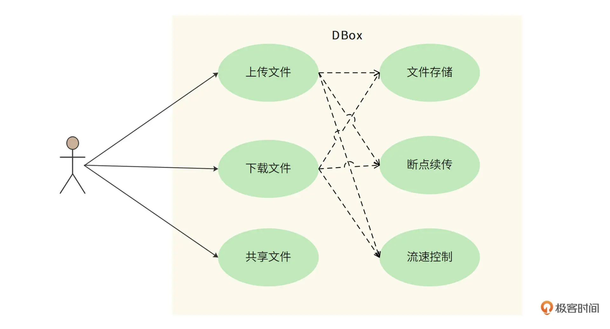

# 背景
网盘，又称云盘，是提供文件托管和文件上传、下载服务的网站（File hosting service）。人们通过网盘保管自己拍摄的照片、视频，通过网盘和他人共享文件，已经成为了一种习惯。我们准备开发一个自己的网盘应用系统，应用名称为“DBox”。

网盘的主要技术挑战是海量数据的高并发读写访问。用户上传的海量数据如何存储？如何避免部分用户频繁读写文件，消耗太多资源，而导致其他的用户体验不佳？

# 功能需求
1. DBox 的核心功能是提供文件上传和下载服务
2. 基于核心功能，DBox 需要在服务器端保存这些文件，并在下载和上传过程中实现断点续传。也就是说，如果上传或下载过程被中断了，恢复之后，还能从中断的地方重新上传或者下载，而不是从头再来。
3. DBox 还需要实现文件共享的需求。使用 DBox 的不同用户之间可以共享文件，一个用户上传的文件共享给其他用户后，其他用户也可以下载这个文件。
4. DBox 需要对上传和下载进行流速控制，保证付费用户得到更多的网络资源。用户文件占据大量硬盘资源，上传、下载需要占用大量网络带宽，并因此产生较高的运营成本，所以用户体验需要向付费用户倾斜。
5. 不重复上传，相同文件内容不重复上传，也就是说，如果用户上传的文件内容已经被其他用户上传过了，该用户不需要再上传一次文件内容，进而实现“秒传”功能。从用户视角来看，不到一秒就可以完成一个大文件的上传。

DBox 用例图如下：

# 非功能需求
1. 规模大小：设计目标是支持 10 亿用户注册使用，免费用户最大可拥有 1TB 存储空间。预计日活用户占总用户的 20%，即 2 亿用户。每个活跃用户平均每天上传、下载 4 个文件。
2. 高可用：文件不丢失，持久存储可靠性达到 99.9999% ，即 100 万个文件最多丢失（或损坏）1 个文件；用户正常上传、下载服务可用性在 99.99% 以上。
3. 安全性：文件需要加密存储，用户本人及共享文件外，其他人不能查看文件内容。

