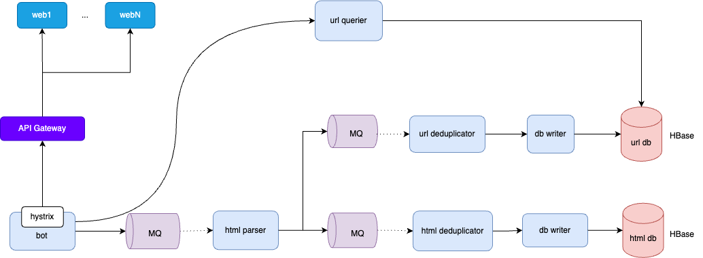

# 概要设计
技术挑战包括：如何不重复地获取并存储全网海量 URL？如何保证爬虫可以快速爬取全网网页但又不会给目标网站带来巨大的并发压力（避免被风控和击溃服务器）？
## 实现原理
如何不重复地获取并存储全网海量 URL？
1. 人工收集所有知名网站的url，作为爬虫的种子url。（解决冷启动）
2. 爬取种子url的html页面，从爬取的html中解析出关联的url，作为后续要爬取的url，依次循环下去，就能获取到全网海量url。

如何保证爬虫可以快速爬取全网网页但又不会给目标网站带来巨大的并发压力（避免被风控和击溃服务器）？

对同一个域名的请求，限制并发数，甚至可以在连续两次请求间设置等待时间。

## 简要架构


# 详细设计
分布式系统的核心是数据，所以我们先从数据存储开始设计。
## 存储设计
因为互联网网页会不断产生，所以全网爬虫 Bajie 也是一个持续运行的系统。根据设计目标， 需要每个月从互联网爬取的网页数为 20 亿个，平均每个页面 500KB，且网页需存储 20 年。

估计平均每个页面 500KB，那么每个月需要新增存储 1PB。网页存储有效期 20 年，那么需要总存储空间 240PB。
```shell
20亿×500KB=1PB
1PB×12个月×20年=240PB
```
TPS 为 800：
```shell
20亿÷（30×24×60×60）≈800
```
因为存储量巨大，因此考虑选用NoSQL HBase。HBase不仅能满足大量存储的要求，也能满足高可用的要求。

## bot service


可以通过预加载待爬取的url这种方式来提升性能，该服务中的每一台服务器都可以预加载待爬取的一批url。由url pool service保障并发安全。

关于页面去重，可以通过计算页面内容的md5来比较去重。然后用布隆过滤器来判断该页面的md5是否存在。

## url pool service


该服务可以通过批量操作来提高服务写性能，比如批量写入HBase。
并发安全通过加锁的方式保障。

URL 去重可以使用布隆过滤器以提高效率。


## 总体架构


# 设计小结
通过这个系统，我们就可以爬取全网的公开网页，并将其存储在HBase中。在满足功能需求的同时，也对系统的健壮性、扩展性进行了保障：
1. 扩展性：我们的bot service和url pool service都是无状态的，通过集群方式部署，可以通过扩大集群来水平扩展爬虫爬取网页的速度。该系统架构也支持未来对图片、视频、文档等内容页面爬取的支持。
2. 高可用：HBase本身就支持高可用，而我们的应用是无状态，通过集群方式部署，某台服务器故障，不影响爬虫任务的工作。
3. 性能：这是一个离线任务，对实时性要求不高，只是为了避免被风控，以及击溃对方的服务器，我们需要对每个域名下的爬取任务进行限流，我们通过引入Hystrix也能很好的保障。（也可以在API Gateway层实现集中式限流）
4. 规模大小：我们使用的NoSQL HBase可以很好的满足数据存储的要求。

注意：
在一些异常情况下，该服务可能存在一些url没有爬取的情况，比如：一台bot service服务器从url pool service获取了一批url，但马上宕机了，这样这一批url就会遗漏。但对于爬虫这种场景，且会重复爬取的情况下，漏掉少量数据可以容忍的。
