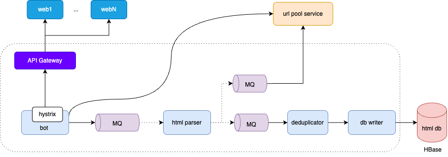

# 概要设计
技术挑战包括：如何不重复地获取并存储全网海量 URL？如何保证爬虫可以快速爬取全网网页但又不会给目标网站带来巨大的并发压力（避免被风控和击溃服务器）？
## 实现原理
如何不重复地获取并存储全网海量 URL？
1. 人工收集所有知名网站的url，作为爬虫的种子url。（解决冷启动）
2. 爬取种子url的html页面，从爬取的html中解析出关联的url，作为后续要爬取的url，依次循环下去，就能获取到全网海量url。

如何保证爬虫可以快速爬取全网网页但又不会给目标网站带来巨大的并发压力（避免被风控和击溃服务器）？

对同一个域名的请求，限制并发数，甚至可以在连续两次请求间设置等待时间。

## 简要架构


# 详细设计
分布式系统的核心是数据，所以我们先从数据存储开始设计。
## 存储设计
因为互联网网页会不断产生，所以全网爬虫 Bajie 也是一个持续运行的系统。根据设计目标， 需要每个月从互联网爬取的网页数为 20 亿个，平均每个页面 500KB，且网页需存储 20 年。

估计平均每个页面 500KB，那么每个月需要新增存储 1PB。网页存储有效期 20 年，那么需要总存储空间 240PB。
```shell
20亿×500KB=1PB
1PB×12个月×20年=240PB
```
TPS 为 800：
```shell
20亿÷（30×24×60×60）≈800
```
因为存储量巨大，因此考虑选用NoSQL HBase。HBase不仅能满足大量存储的要求，也能满足高可用的要求。

## bot service


## url pool service


## 总体架构


# 设计小结