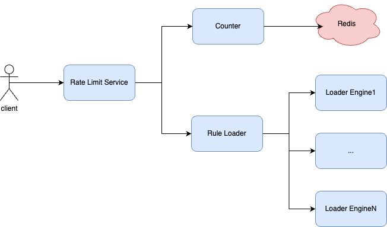

# 实现原理
如何实时计算当前时刻的QPS？
1. 采用滑动窗口的方式
2. 采用分桶统计的方式来实时计算当前QPS，比如使用100个bucket，每个bucket代表10ms内的请求量统计。这样100个bucket的累积量就代表过去1s内的请求量。
3. 支持单机和集群两种模型的限流。集群模式通过将单机上的bucket同步到redis上来实现。

# 概要设计

# 详细设计
## Counter
负责统计各个资源维度的请求量信息。通过分桶方式来保存各个时间段（10ms）内的请求量。同时，用原子操作来保障每个bucket中请求量的准确性。

在单机模式下，Counter只需要将过去1s内100个bucket的值存在本机上就行，如果因为当前请求使得原子自增操作后的QPS值超过设定的阈值，则表示当前请求已经超过预期，需要限流，拒绝该请求，并将对应bucket的请求量原子自减。

在集群模式下，Counter在单机模式的基础上，会将本地分桶的数据定期（每ms）同步到redis上，并将其它机器的分桶数据也获取下来，从而判断当前集群请求量是否超过了设定的阈值。

## Rule Loader 
通过定义rule load的接口，具体的rule加载通过实现该接口来完成，这样就能符合开闭原则。

## Rate Limit Service
负责处理限流器的业务逻辑，根据定义的限流规则和当前各个资源维度的请求量大小，来对用户请求进行限流判定。

用户请求进入限流器后，根据限流策略，判断该请求是否已经超过限流，如果超过，限流器直接返回状态码为 503（Too Many Requests）的响应；如果没有超过限流，请求继续向下处理（经过其他网关过滤器），并最终调用微服务完成处理。

# Q&A